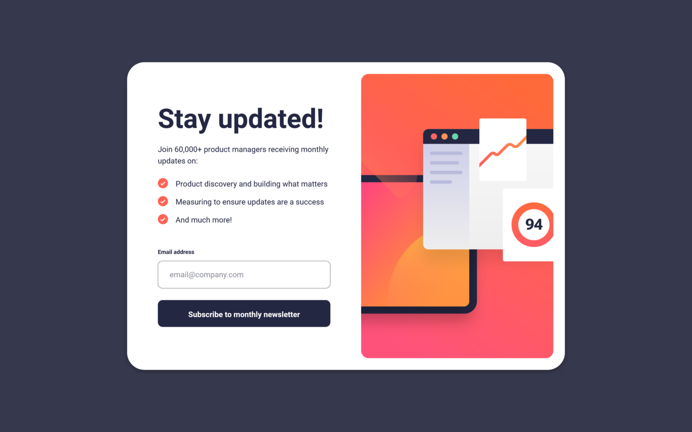
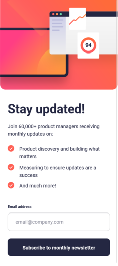

# Frontend Mentor - Newsletter sign-up form with success message solution

This is a solution to the [Newsletter sign-up form with success message challenge on Frontend Mentor](https://www.frontendmentor.io/challenges/newsletter-signup-form-with-success-message-3FC1AZbNrv). Frontend Mentor challenges help you improve your coding skills by building realistic projects.

## Table of contents

- [Overview](#overview)
  - [The challenge](#the-challenge)
  - [Screenshot](#screenshot)
  - [Links](#links)
- [My process](#my-process)
  - [Built with](#built-with)
  - [What I learned](#what-i-learned)
  - [Useful resources](#useful-resources)
- [Author](#author)

## Overview

### The challenge

Users should be able to:

- Add their email and submit the form
- See a success message with their email after successfully submitting the form
- See form validation messages if:
  - The field is left empty
  - The email address is not formatted correctly
- View the optimal layout for the interface depending on their device's screen size
- See hover and focus states for all interactive elements on the page

### Screenshot

### Links

- Solution URL: [Add solution URL here](https://your-solution-url.com)
- Live Site URL: [Add live site URL here](https://your-live-site-url.com)

## My process

### Built with

- Semantic HTML5 markup
- CSS custom properties
- Flexbox
- CSS Grid
- Desktop-first workflow
- Javascript

### What I learned

In this challenge, I practiced a bit with something stylistically easier than the last one (the space agency challenge), I set up the work using Flexbox for the general layout, and for the internal blocks, like the input field; I had a bit of difficulty with the Javascript implementation of the 'Submit button' linked to tab switching, and I had to seek help from other people's solutions and watching a video about this topic.

Overall it was interesting, a great workout!

### Continued development

In the next period I want to face various challenges, both regarding individual components, as in this case, web pages that are a bit more complex and articulated.

## Author

- Frontend Mentor - [@p4bloxx](https://www.frontendmentor.io/profile/p4bloxx)
- Github - [@p4bloxx](https://github.com/p4bloxx)
